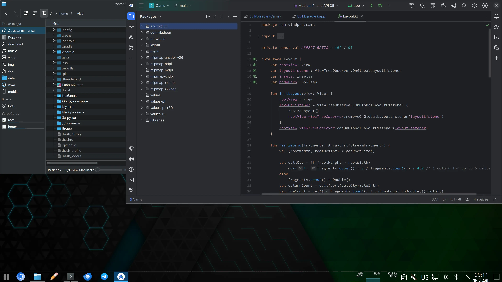

# Тёмная тема для нижней ("южной") панели KDE Plasma 6



Состоит из трёх файлов:

1. metadata.desktop - обязательное описание темы;
2. widgets/panel-background.svg - отвечает за фон панели (south-center) и верхнюю границу (south-top);
3. widgets/tasks.svg - кнопки приложений на панели задач.

Разделитель индикаторов запуска (group-expander-bottom в tasks.svg) выполнен в виде прямоугольника,
что примерно соответствует режиму "сегменты" расширения dash-to-panel Gnome 3.

Файлы можно легко редактировать в обычном текстовом редакторе.

Для установки темы нужно скопировать эти три файла (сохраняя сруктуру папок) в папку
```bash
~/.local/share/plasma/desktoptheme/south-panel-dark
```
 для текущего пользователя или
```bash
/usr/share/plasma/desktoptheme/south-panel-dark
```
для всех пользователей.

Подробности на Хабре: [habr.com/ru/posts/865572](https://habr.com/ru/posts/865572/)
